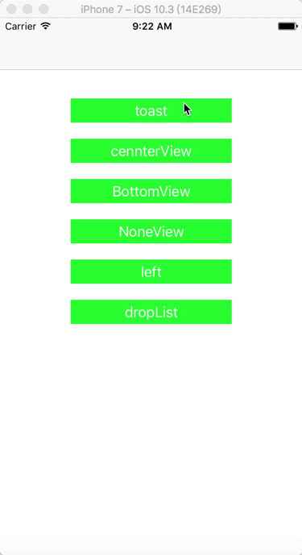
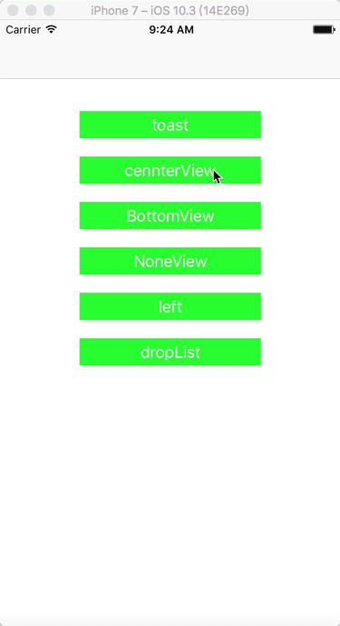

BAlertView
===================


BAlertView 主要提供两种功能

1. 显示吐司,包含上中下三种样式，可控制显示时间。
2. 弹出自定义的view，包含部分动画效果。

----------

<div align=center>
 
 


</div>

----------------

cocoapods
-------------
```
pod 'BAlertView'
```
使用方法
-------------

```
#import "BAlertModal.h"
```

#### <i class="icon-file"></i> 显示Toast 
使用方法
```
//常规用法
[[BAlertModal sharedInstance]makeToast:@"hellow world"];
//宏定义用法
BMAKECENTERTOAST(@"DAFDFASDFASDFA");
```
样式控制
```
typedef NS_ENUM(NSInteger,BAlertModalToastDisPlayStyle){
BAlertModalToastTop,
BAlertModalToastCenter,
BAlertModalToastBottom

};

typedef NS_ENUM(NSInteger,BAlertModalToastDisPlayTime){
BAlertModalToastLong, //4s
BAlertModalToastshort //2s


};
```
#### <i class="icon-file"></i>  显示自定义对话框

使用方法
```
[[BAlertModal sharedInstance]showAlerView:view disPlayStyle:BAlertModalViewCenter];
```
样式控制
```
typedef NS_ENUM(NSInteger,BAlertModalViewDisPlayStyle){
BAlertModalViewNone,// 位置根据传入的view frame决定
BAlertModalViewCenter,//默认中间 宽高自定
BAlertModalViewBottom ,//底部 view宽度与屏幕等宽，高度自定
BAlertModalViewDropList, //下拉样式显示
BAlertModalViewLeftMove//从左侧移动过来


};
```
